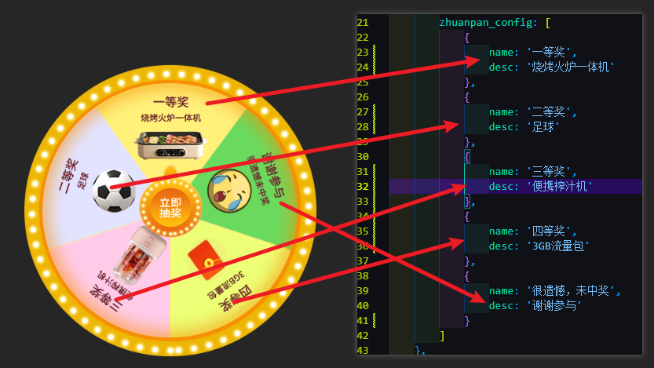

# 大转盘活动页面

经常使用大转盘做用户抽奖的活动，所以将大转盘组件独立出来，方便以后复用。主要针对手机页面，兼容到所有手机。

## 功能

1. 可用设定用户抽奖次数,支持连续抽奖，根据需要修改`dazhuanpan.js`中的：
```js
user_info: {
    phone: '189***1234',
    jihui: 5,//抽奖机会数
}
```
2. 可以对大转盘做任意份数的切割，以便放置不同数量的奖品，请配置`dazhuanpan.js`中的：
```js
zhuanpan_config: [
    {
        name: '一等奖',
        desc: '烧烤火炉一体机'
    },
    {
        name: '二等奖',
        desc: '足球'
    },
    {
        name: '三等奖',
        desc: '便携榨汁机'
    },
    {
        name: '四等奖',
        desc: '3GB流量包'
    },
    {
        name: '很遗憾，未中奖',
        desc: '谢谢参与'
    }
    ......//// 有几个放几个，但是建议最后一个放谢谢参与，以便控制中奖概率。
]
```
当然啦，js里面的配置项，要和你自己的转盘图片中的内容一一对应哦，要不然转的时候角度会错位的。


## 模板

考虑
