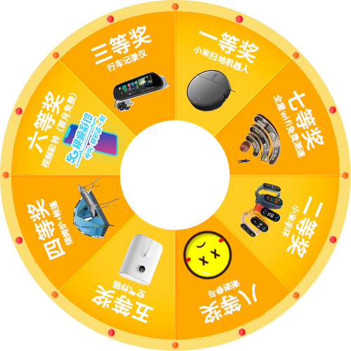

# 大转盘活动页面
经常使用大转盘做用户抽奖的活动，不如将大转盘组件独立出来，方便以后复用。主要针对手机页面，宽高用了vw做单位，兼容到所有手机。


## 功能

1. 判断抽奖机会（默认三次），根据需要修改my.js中的：
```js
let chou = 3;//抽奖次数
```
2. 可以对大转盘做任意份数的切割，以便放置不同数量的奖品，默认分为8份数。根据需要在修改my.js中的：555
```js
const base_number = 8; //将大转盘的角度分为8份
```
## 模板


## 调试